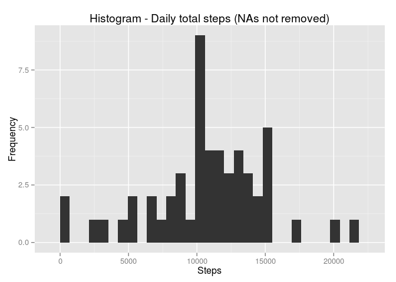
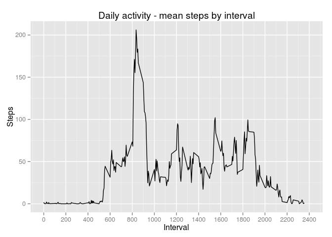
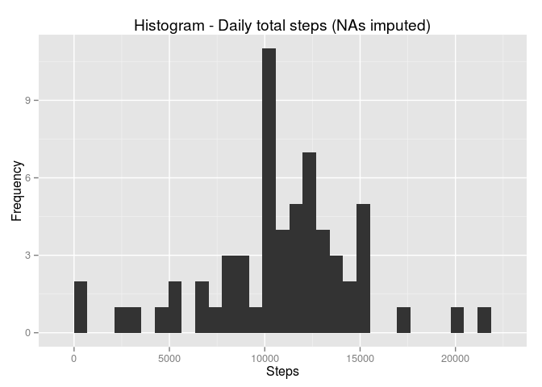

# Reproducible Research: Peer Assessment 1
Doug Fleming  
March 15, 2015  

(NOTE to reviewer: A figure directory was not included and not needed since all figures in this document are embedded into the document)

### Loading and preprocessing the data

The activity and monitoring data is loaded directly from the internet source and processed for analysis. In the initial load, two variables are added, DOW (day of week) and daytype ("weekday" or "weekend").


```r
library(dplyr)
library(lubridate)
library(ggplot2)

##function to display in-line r code when required
rinline <- function(code){
  html <- '<code  class="r">``` `r CODE` ```</code>'
  sub("CODE", code, html)
}

#to prevent formatting of output to scientific notation
options(scipen = 1, digits = 2)

#set data directory location and filename 
dataDir <- "./data"
activityFile <- paste(dataDir,"/repdata_data_activity.zip", sep="");

if (!file.exists(dataDir)) {
  dir.create(file.path(dataDir))
}

if (!file.exists(activityFile)) {
  if (.Platform$OS.type == "windows") {
    setInternet2(TRUE)
  }
  download.file("https://d396qusza40orc.cloudfront.net/repdata%2Fdata%2Factivity.zip", activityFile)
}

#read data file, add weekday/weekend and day of week variables
actData <- read.csv(unz(activityFile,"activity.csv"))
actData <- mutate(actData, daytype = ifelse(wday(date, label=T) %in% c("Sat","Sun"),'Weekend','Weekday'))
actData <- mutate(actData, dow = wday(date, label=T))

#sum steps per day
totStepsPerDay <- actData[!is.na(actData$steps),] %>%
  group_by(date) %>% 
  summarise( totSteps = sum(steps))

#calc mean/median steps per day
medianStepsPerDay <- round(median(totStepsPerDay$totSteps),0)
meanStepsPerDay <- round(mean(totStepsPerDay$totSteps),0)

#plot histogram of total steps per day
ggplot(data=totStepsPerDay, aes(x=totSteps)) + 
  geom_histogram() +
  ylab("Frequency") +
  xlab("Steps") +
  ggtitle("Histogram - Daily total steps (NAs not removed)")
```

 

### What is mean total number of steps taken per day?

1. Median steps per day: 10765  (for reviewer: inline code used here - <code  class="r">``` `r medianStepsPerDay` ```</code>)
2. Mean steps per day: 10766 (inline code used here ) <code  class="r">``` `r meanStepsPerDay` ```</code>
 
### What is the average daily activity pattern?

Plotted below is the average daily activity pattern. The 'interval' ticks on the x-axis correspond to hours in the 24 hour day (i.e. every 2 hours. 200 = 0200, 1600 = 1600/4pm, etc.). Activity patterns show a morning peak at approximately 0800/8am, noon peak at 1200/12pm, afternoon peak at 1600/4pm and two evening peaks. Activity decreases to almost nothing between ~2200 and 0530.


```r
#calculate means steps by interval across all days
meanByInterval <- actData[!is.na(actData$steps),] %>%
  group_by(interval) %>%
  summarise_each_(funs(mean), vars = c("interval","steps"))

#line plot of mean steps by interval
ggplot(data=meanByInterval, aes(x=interval, y=steps)) + 
          geom_line() + 
          ggtitle("Daily activity - mean steps by interval") + 
          ylab("Steps") + 
          xlab("Interval") +
          scale_x_continuous(limits=c(0, 2400), breaks=seq(0,2400,200))
```

 

**Interval with Maximum average steps**: 835 (206 average steps)

(reviewer - inline code above:  <code  class="r">``` `r meanByInterval[meanByInterval$steps == max(meanByInterval$steps),]$interval` ```</code> to display the interval, and <code  class="r">``` `r r round(max(meanByInterval$steps))` ```</code> to display the average steps )

### Imputing missing values

Missing values (for steps) are imputed using the mean of each interval by the day of week. This interval mean is used to replace NA on the corresponding interval/day.


```r
#get number of rows with NA steps
numNA <- nrow(actData[is.na(actData$steps),])
```

1. Number of step observations with NA: 2304 (for reviewer: inline code - <code  class="r">``` `r numNA` ```</code>)

2. Fill in NA values using mean of the interval (by the day of week). NOTE: rather than creating a new dataset, a new column was added to original dataset with NA values filled in.


```r
#create data frame of with interval, day-of-week, mean steps by interval - use
# to fill in NA values based on day-of-week, interval.
mid <- actData[!is.na(actData$steps),] %>%
  group_by(interval, dow) %>%
  summarise_each_(funs(mean), vars = c("interval","steps","dow"))

#apply mean steps based on interval, day-of-week when steps = NA (rather than creating new dataset, just
# add new column to original dataset)
actData$StepsIntDOW <- as.numeric(apply(actData,1, function(x) if( is.na(x[1])) round(mid[mid$interval == as.numeric(x[3]) & mid$dow ==  x[5],]$steps,0) else x[1][[1]][[1]]))
```

Histogram of steps per day with NAs filled in:


```r
#find new total steps per day, with NA step observations filled in 
totStepsPerDayIntDOW <- actData %>%
  group_by(date) %>% 
  summarise( totSteps = sum(StepsIntDOW))

#plot histogram with filled in NA
ggplot(data=totStepsPerDayIntDOW, aes(x=totSteps)) + 
  geom_histogram() +
  ylab("Frequency") +
  xlab("Steps") +
  ggtitle("Histogram - Daily total steps (NAs imputed)")
```

 

Calculate/display mean and median steps per day with NAs filled in


```r
#calculate mean/median steps per day with NA filled in
medianStepsPerDayIntDOW <- median(totStepsPerDayIntDOW$totSteps)
meanStepsPerDayIntDOW <- mean(totStepsPerDayIntDOW$totSteps)
```
1. Mean steps per day: 10821.1  (inline code: <code  class="r">``` `r meanStepsPerDayIntDOW` ```</code>)
2. Median steps pers day: 11015  (inline code: <code  class="r">``` `r medianStepsPerDayIntDOW` ```</code>)

### Are there differences in activity patterns between weekdays and weekends?

Two versions of this analysis are plotted below. Weekend vs Weekday activity patterns with the original data (NA values not replaced) and same plots with NA values replaced. Replacing NA does not seem to make much difference.

However, significant differences exist between activity patterns of weekend vs weekday(on both versions). Weekend activity begins later in the day with peak periods late in the day on weekend vs early on weekdays.


```r
#Weekend vs Weekday activity (NA step values not removed)
ggplot(data=actData, aes(x=interval, y=steps)) + 
          geom_line() + 
          facet_grid(daytype ~ .) +
          ggtitle("Weekend vs Weekday Activity \n (NA not removed)") + 
          ylab("Steps") + 
          xlab("Interval")+
          scale_x_continuous(limits=c(0, 2400), breaks=seq(0,2400,200))
```

 

```r
#Weekend vs Weekday activity (NA step values replaced)
ggplot(data=actData, aes(x=interval, y=StepsIntDOW)) + 
          geom_line() + 
          facet_grid(daytype ~ .) +
          ggtitle("Weekend vs Weekday Activity \n (NA replaced with Mean of steps by Interval, Day of Week)") + 
          ylab("Steps") + 
          xlab("Interval")+
          scale_x_continuous(limits=c(0, 2400), breaks=seq(0,2400,200))
```

 
